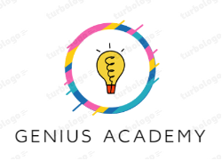

<a name="readme-top"></a>

<div align="center">
  <!-- You are encouraged to replace this logo with your own! Otherwise you can also remove it. -->
  
  <br/>

  <h3><b>Genius Academy</b></h3>
  <h3><b>Genius Academy</b></h3>

</div>

<!-- TABLE OF CONTENTS -->

# 📗 Table of Contents

- [📗 Table of Contents](#-table-of-contents)
- [📖 \[Genius Academy\] ](#-genius-academy-)
- [📖 \[Genius Academy\] ](#-genius-academy--1)
  - [🛠 Built With ](#-built-with-)
    - [Tech Stack ](#tech-stack-)
    - [Key Features ](#key-features-)
  - [🚀 Live Demo ](#-live-demo-)
  - [💻 Getting Started ](#-getting-started-)
    - [Prerequisites](#prerequisites)
    - [Setup](#setup)
    - [Install](#install)
    - [Usage](#usage)
    - [Run tests](#run-tests)

<!-- PROJECT DESCRIPTION -->

# 📖 [Genius Academy] <a name="about-project"></a>

# 📖 [Genius Academy] <a name="about-project"></a>

**[Genius Academy]** is my first Capstone project that mimics a real-world project.
**[Genius Academy]** is my first Capstone project that mimics a real-world project.

## 🛠 Built With <a name="built-with"></a>

1. ✅ **HTML**
2. ✅ **CSS**
3. ✅ **JavaScript**
4. ✅ **LightHouse**
5. ✅ **WebHint**
6. ✅ **Styelint**
7. ✅ **ESLint**
8. ✅ **Git**
9. ✅ **Github**

10. ✅ **HTML**
11. ✅ **CSS**
12. ✅ **JavaScript**
13. ✅ **LightHouse**
14. ✅ **WebHint**
15. ✅ **Styelint**
16. ✅ **ESLint**
17. ✅ **Git**
18. ✅ **Github**

### Tech Stack <a name="tech-stack"></a>

<details>
  <summary>Client</summary>
  <ul>
    <li><a href="https://reactjs.org/">React.js</a></li>
  </ul>
</details>

<details>
  <summary>Server</summary>
  <ul>
    <li><a href="https://expressjs.com/">Express.js</a></li>
  </ul>
</details>

<details>
<summary>Database</summary>
  <ul>
    <li><a href="https://www.postgresql.org/">PostgreSQL</a></li>
  </ul>
</details>

<!-- Features -->

### Key Features <a name="key-features"></a>

> Describe between 1-3 key features of the application.

- 🔰 **[Home page]**
- 🔰 **[About Page]**
- 🔰 **[Menu Section]**
- 🔰 **[Responsive]**
- 🔰 **[Good look and feel]**
- 🔰 **[Home page]**
- 🔰 **[About Page]**
- 🔰 **[Menu Section]**
- 🔰 **[Responsive]**
- 🔰 **[Good look and feel]**

<p align="right">(<a href="#readme-top">back to top</a>)</p>

<!-- LIVE DEMO -->

## 🚀 Live Demo <a name="live-demo"></a>

> It will be added later
> It will be added later

<!-- - [Live Demo Link](https://google.com) -->
<!-- - [Live Demo Link](https://google.com) -->

<p align="right">(<a href="#readme-top">back to top</a>)</p>

<!-- GETTING STARTED -->

## 💻 Getting Started <a name="getting-started"></a>

**To get a local copy up and running, follow these steps.**
**To get a local copy up and running, follow these steps.**

1. Download or clone this [repostory](https://github.com/M-Anwar-Hussaini/Genius-Academy).
2. Provide a browser.
3. Open the `index.html` file using webpage browser.
4. Download or clone this [repostory](https://github.com/M-Anwar-Hussaini/Genius-Academy).
5. Provide a browser.
6. Open the `index.html` file using webpage browser.

### Prerequisites

**In order to run this project you need:**

- ✔ [Git](https://git-scm.com/downloads) installed in your machine.
- ✔ Sign in or sign up to your [Github](https://github.com/) account.
- ✔ A professional editer such as [VS Code](https://code.visualstudio.com/download).
- ✔ An Updated web browser such as Google Chrome, you can download it from [here](https://www.google.com/chrome/).
- [Node.js](https://nodejs.org/en/download) installed in your machine.
- ✔ Lighthouse.
- ✔ Webhint

```sh
npm init -y
npm install --save-dev hint@7.x
npx hint .
```

- ✔ Stylelint

```sh
npm install --save-dev stylelint@13.x stylelint-scss@3.x stylelint-config-standard@21.x stylelint-csstree-validator@1.x
```

**In order to run this project you need:**

- ✔ [Git](https://git-scm.com/downloads) installed in your machine.
- ✔ Sign in or sign up to your [Github](https://github.com/) account.
- ✔ A professional editer such as [VS Code](https://code.visualstudio.com/download).
- ✔ An Updated web browser such as Google Chrome, you can download it from [here](https://www.google.com/chrome/).
- [Node.js](https://nodejs.org/en/download) installed in your machine.
- ✔ Lighthouse.
- ✔ Webhint

```sh
npm init -y
npm install --save-dev hint@7.x
npx hint .
```

- ✔ Stylelint

```sh
npm install --save-dev stylelint@13.x stylelint-scss@3.x stylelint-config-standard@21.x stylelint-csstree-validator@1.x
```

- ✔ ESLint
- ✔ ESLint

```sh
npm install --save-dev eslint@7.x eslint-config-airbnb-base@14.x eslint-plugin-import@2.x babel-eslint@10.x
npm install --save-dev eslint@7.x eslint-config-airbnb-base@14.x eslint-plugin-import@2.x babel-eslint@10.x
```

### Setup

- Clone this [repository](https://github.com/M-Anwar-Hussaini/Genius-Academy.git) to your desired folder:

- Example commands:

```sh
  cd [YOUR FOLDER]
  git clone https://github.com/M-Anwar-Hussaini/Genius-Academy.git
  cd [YOUR FOLDER]
  git clone https://github.com/M-Anwar-Hussaini/Genius-Academy.git
```

### Install

- Install this project by cloning or downloading the master branch of this [repository](https://github.com/M-Anwar-Hussaini/Genius-Academy) and run `index.html` file on the root of repository.

### Usage

- To run the project, execute the following command:

```sh
 cd [YOUR FOLDER]
 git clone https://github.com/M-Anwar-Hussaini/Genius-Academy.git
```

### Run tests

1. WebHint ☑

```
npx hint .
```

2. Stylelint ☑

```
npx stylelint "**/*.{css,scss}"
```

1. WebHint ☑

```
npx hint .
```

2. Stylelint ☑

```
npx stylelint "**/*.{css,scss}"
```

3. ESLint ☑
4. ESLint ☑

```
npx eslint .
```

npx eslint .

```

### Deployment

**This project is deployed by the author, no permission for deployment by any other client.**
**This project is deployed by the author, no permission for deployment by any other client.**

<p align="right">(<a href="#readme-top">back to top</a>)</p>

<!-- AUTHORS -->

## 👥 Authors <a name="authors"></a>

👤 **Mohammad Anwar Hussaini (Main Author)**

- 👤 GitHub: [@Anwar Hussaini](https://github.com/M-Anwar-Hussaini)
- 👤 Twitter: [@MAnwarHussaini](https://twitter.com/MAnwarHussaini)
- 👤 LinkedIn: [Mohammad Anwar Hussaini](https://www.linkedin.com/in/mohammad-anwar-hussaini-876638267/)

<p align="right">(<a href="#readme-top">back to top</a>)</p>

<!-- FUTURE FEATURES -->

## 🔭 Future Features <a name="future-features"></a>

- [ ] **[Client interaction]**
- [ ] **[Deploy to a universal server]**
- [ ] **[Tutorials]**

<p align="right">(<a href="#readme-top">back to top</a>)</p>

<!-- CONTRIBUTING -->

## 🤝 Contributing <a name="contributing"></a>

Contributions, issues, and feature requests are welcome!

Feel free to check the [issues page](<[../../issues/](https://github.com/M-Anwar-Hussaini/Genius-Academy/issues)>).
Feel free to check the [issues page](<[../../issues/](https://github.com/M-Anwar-Hussaini/Genius-Academy/issues)>).

<p align="right">(<a href="#readme-top">back to top</a>)</p>

<!-- SUPPORT -->

## ⭐️ Show your support <a name="support"></a>

If you like this project, kindly drop a start for the [repository](https://github.com/M-Anwar-Hussaini/Genius-Academy);
If you like this project, kindly drop a start for the [repository](https://github.com/M-Anwar-Hussaini/Genius-Academy);

<p align="right">(<a href="#readme-top">back to top</a>)</p>

<!-- ACKNOWLEDGEMENTS -->

## 🙏 Acknowledgments <a name="acknowledgements"></a>

I would like to thank [Microverse](https://www.microverse.org/?grsf=mohammad-a-nbtazu) for providing the opportunity for this project to be done.
I would like to thank [Microverse](https://www.microverse.org/?grsf=mohammad-a-nbtazu) for providing the opportunity for this project to be done.

<p align="right">(<a href="#readme-top">back to top</a>)</p>

<p align="right">(<a href="#readme-top">back to top</a>)</p>

<!-- LICENSE -->

## 📝 License <a name="license"></a>

This project is [MIT](MIT.md) licensed.
This project is [MIT](MIT.md) licensed.

<p align="right">(<a href="#readme-top">back to top</a>)</p>
```
